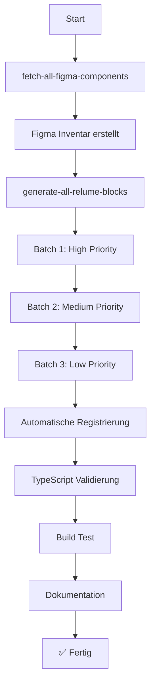

# Cursor MDC Commands - Vollständige Block-Generierung

Dieses Verzeichnis enthält optimierte Cursor MDC-Befehle für die systematische Erfassung **ALLER** Figma-Komponenten und die automatische Generierung von PayloadCMS Blocks.

---

## 📋 Übersicht

### Anzahl der Komponenten (für Pages Collection)
- **20 Kategorien** (für statische Pages)
- **1071 Relume-Komponenten**
- **3213 zu generierende Dateien** (1071 × 3)

### Ausgeschlossen (für separate Module)
- **6 Kategorien** (Blog, Career, Events, Portfolio)
- **172 Komponenten** für dynamische Detail-Seiten
- Separate Prompts für Blog-Modul, Service-Modul, Projekt-Modul

---

## 🚀 Quick Start

### Vollständige Bulk-Generierung (Empfohlen)
```bash
# In Cursor AI Command Palette (Cmd/Ctrl+K):
> Generate ALL Relume Blocks - Master Orchestrator
```

Dieser Command orchestriert den kompletten Workflow:
1. ✅ Figma-Komponenten erfassen
2. ✅ Mit Relume-Templates mappen
3. ✅ Alle 1243+ Blocks generieren
4. ✅ Automatisch in PayloadCMS registrieren
5. ✅ TypeScript validieren
6. ✅ Dokumentation erstellen

**Geschätzte Dauer:** 15-18 Minuten (weniger Komponenten durch Fokus auf Pages)

---

## 📁 Verfügbare Commands

### 🎯 Master-Commands

#### `generate-all-relume-blocks.mdc`
**Zweck:** Orchestriert die vollständige Bulk-Generierung aller Blocks
**Verwendet:** Batch-basierte Generierung mit Priorisierung
**Output:** 
- 3213 Dateien (Component.tsx, config.ts, index.ts)
- Automatische Registrierung in Pages Collection
- Vollständige Dokumentation

**Batch-Struktur:**
- **Batch 1 (High Priority):** Layout, Header, CTA, Testimonials, Contact, Pricing, Navbar, Footer (876 Komponenten)
- **Batch 2 (Medium Priority):** MultistepForms, Gallery, Team, Banners, FAQ, ContactModal (131 Komponenten)
- **Batch 3 (Low Priority):** Timelines, Comparison, EventHeaderItems, EventHeaders, Logo, Loader (64 Komponenten)

**Ausgeschlossen für separate Module:**
- Blog, BlogPostHeader → Blog-Modul (73 Komponenten)
- Career → Service-/Angebotsmodul (27 Komponenten)
- Events, Portfolio, PortfolioHeader → Projektmodul (72 Komponenten)

---

#### `fetch-all-figma-components.mdc`
**Zweck:** Systematische Erfassung ALLER Figma-Komponenten
**Features:**
- Rekursives Scannen aller Seiten
- Alle Node-Typen (FRAME, COMPONENT, INSTANCE, GROUP, etc.)
- Keine Ausschlüsse (Hero, Navbar, Footer werden erfasst)
- Automatisches Mapping zu Relume-Templates
- JSON + Markdown Export

**Output:**
- `FIGMA_INVENTORY.json` - Vollständiges Inventar
- `FIGMA_INVENTORY.md` - Menschenlesbare Übersicht

**Verwendung:**
```bash
> Fetch ALL Figma Components
```

---

#### `build-blocks-full.mdc`
**Zweck:** Detaillierte Dokumentation der Block-Generierung
**Enthält:**
- Alle 26 Kategorien mit Beschreibungen
- Generierungs-Templates
- Code-Beispiele für Component.tsx, config.ts
- Registrierungs-Logik
- Performance-Optimierungen

**Verwendung:** Referenz-Dokument für die Implementierung

---

### 🔧 Spezifische Commands

#### `build-blocks.mdc`
**Zweck:** Ursprünglicher Block-Generator (Legacy)
**Einschränkung:** Überspringt Hero, Navbar, Footer
**Status:** ⚠️ Veraltet - Verwende stattdessen `build-blocks-full.mdc`

#### `build-hero.mdc`
**Zweck:** Spezifische Hero-Section Generierung
**Verwendung:** Für separate Hero-Generierung in `src/heros/`

#### `build-navbar.mdc`
**Zweck:** Navbar-spezifische Generierung
**Verwendung:** Für Navigationsleisten unter `src/Header/`

#### `build-page.mdc`
**Zweck:** Einzelne Page-Generierung

---

### 🎨 Design & Styling

#### `optimize-tailwind.mdc`
**Zweck:** Tailwind-Konfiguration aus Figma generieren
**Features:**
- Design-Tokens extrahieren
- Farben, Typografie, Spacing
- `tailwind.config.mjs` generieren
- `globals.css` erstellen

#### `style-buttons.mdc`
**Zweck:** Button-Komponenten aus Figma erstellen
**Output:** `src/components/ui/button.tsx`

---

### 🛠️ Utility Commands

#### `test-figma-connection.mdc`
**Zweck:** Figma MCP Verbindung testen
**Verwendet:** Vor der Block-Generierung
**Output:** Liste aller erkannten Figma-Komponenten

#### `clear-context.mdc`
**Zweck:** Context-Management
**Verwendet:** Zwischen Phasen zur Performance-Optimierung

#### `setup-project-workflow.mdc`
**Zweck:** Initial Project Setup

---

## 📊 Kategorien-Übersicht

| Kategorie | Anzahl | Priorität | Beschreibung | Verwendung |
|-----------|--------|-----------|--------------|------------|
| **Layout** | 527 | High | Basis-Layouts, Container, Grids | Alle statischen Pages |
| **Header** | 152 | High | Hero Sections, Header-Varianten | Homepage, Landing Pages |
| **CTA** | 58 | High | Call-to-Action Sections | Conversions, Lead-Gen |
| **Testimonials** | 43 | High | Kundenbewertungen | Social Proof |
| **Contact** | 30 | High | Kontaktformulare | Kontakt-Seite |
| **Pricing** | 27 | High | Preistabellen | Pricing-Seite |
| **Navbar** | 22 | High | Navigationsleisten | Globale Navigation |
| **Footer** | 17 | High | Footer-Varianten | Alle Pages |
| **MultistepForms** | 46 | Medium | Mehrstufige Formulare | Komplexe Forms |
| **Gallery** | 27 | Medium | Bild-/Video-Galerien | Portfolio-Übersicht |
| **Team** | 22 | Medium | Team-Sections | Team-Seite |
| **Banners** | 16 | Medium | Notification-Banner | Announcements |
| **FAQ** | 14 | Medium | FAQ-Sections | Support-Seite |
| **ContactModal** | 6 | Medium | Kontakt-Modals | Quick Contact |
| **Timelines** | 21 | Low | Zeitstrahl-Darstellungen | About, History |
| **Comparison** | 15 | Low | Vergleichstabellen | Feature-Vergleich |
| **EventHeaderItems** | 11 | Low | Event-Header Elemente | Event-Übersicht |
| **EventHeaders** | 6 | Low | Event-Hero Sections | Event-Übersicht |
| **Logo** | 6 | Low | Logo-Displays | Trust-Badges |
| **Loader** | 5 | Low | Loading States | Loading-Feedback |

**Gesamt für Pages Collection:** 1071 Komponenten

### ❌ Ausgeschlossene Kategorien (Separate Module)

| Kategorie | Anzahl | Modul | Routes |
|-----------|--------|-------|--------|
| **Blog** | 68 | Blog-Modul | `/blog/[slug]` |
| **BlogPostHeader** | 5 | Blog-Modul | `/blog/[slug]` |
| **Career** | 27 | Service-Modul | `/angebote/[slug]` |
| **Events** | 37 | Projekt-Modul | `/projekte/[slug]` |
| **Portfolio** | 23 | Projekt-Modul | `/projekte/[slug]` |
| **PortfolioHeader** | 12 | Projekt-Modul | `/projekte/[slug]` |

**Gesamt ausgeschlossen:** 172 Komponenten (für separate Prompts)

---

## 🔄 Workflow

### Empfohlener Ablauf



### Schritt-für-Schritt

1. **Vorbereitung**
   ```bash
   # Figma-Verbindung testen
   > Test Figma MCP Connection
   
   # Tailwind optimieren
   > Optimize Tailwind
   ```

2. **Figma-Erfassung**
   ```bash
   > Fetch ALL Figma Components
   ```
   Output: `FIGMA_INVENTORY.json`, `FIGMA_INVENTORY.md`

3. **Block-Generierung**
   ```bash
   > Generate ALL Relume Blocks - Master Orchestrator
   ```
   Dauer: ~20-25 Minuten
   
   Phasen:
   - ✅ Phase 1: Analyse & Planung (~2 Min)
   - ✅ Phase 2: Batch-Generierung (~15-20 Min)
   - ✅ Phase 3: Registrierung (~2 Min)
   - ✅ Phase 4: Validierung (~5 Min)
   - ✅ Phase 5: Dokumentation (~1 Min)

4. **Validierung**
   ```bash
   npm run type-check
   npm run build
   npm run dev
   ```

5. **Admin-Panel Test**
   - Öffne http://localhost:3000/admin
   - Gehe zu Pages → Neue Page
   - Prüfe: Alle 1243+ Blocks verfügbar
   - Prüfe: Deutsche Labels korrekt
   - Prüfe: Gruppierung funktioniert

---

## 📁 Generierte Dateistruktur

Nach vollständiger Generierung:

```
src/
├── blocks/
│   ├── Layout/
│   │   ├── Layout1/
│   │   │   ├── Component.tsx
│   │   │   ├── config.ts
│   │   │   └── index.ts
│   │   ├── Layout2/
│   │   │   └── ...
│   │   └── ... (527 Komponenten)
│   ├── Header/
│   │   ├── Header1/
│   │   │   └── ...
│   │   └── ... (152 Komponenten)
│   ├── Blog/
│   │   └── ... (68 Komponenten)
│   ├── CTA/
│   │   └── ... (58 Komponenten)
│   ├── MultistepForms/
│   │   └── ... (46 Komponenten)
│   └── ... (21 weitere Kategorien)
│   └── index.ts (Zentrale Exports)
│
├── collections/
│   └── Pages/
│       └── config.ts (1243+ Blocks registriert)
│
└── components/
    └── PageRenderer/
        └── index.tsx (1243+ Komponenten gemappt)
```

**Gesamt:** 3729 Dateien

---

## 🎨 Block-Template

Jeder generierte Block folgt diesem Template:

### Component.tsx
```tsx
import React from 'react'
import { RichText } from '@/components/RichText'
import { Media } from '@/components/Media'
import { CMSLink } from '@/components/CMSLink'
import type { {ComponentName}Block } from '@/payload-types'

interface {ComponentName}Props {
  block: {ComponentName}Block
}

export const {ComponentName}: React.FC<{ComponentName}Props> = ({ block }) => {
  const { title, content, media, cta } = block || {}
  
  return (
    <section className="py-16 md:py-24">
      <div className="container mx-auto">
        {title && <h2 className="text-3xl font-bold">{title}</h2>}
        {content && <RichText content={content} />}
        {media && <Media resource={media} />}
        {cta && <CMSLink {...cta} />}
      </div>
    </section>
  )
}
```

### config.ts
```typescript
import { Block } from 'payload/types'

export const {ComponentName}Block: Block = {
  slug: '{category}{componentName}',
  labels: {
    singular: '{ComponentName}',
    plural: '{ComponentName} Blöcke',
  },
  fields: [
    {
      name: 'title',
      type: 'text',
      label: 'Titel',
      admin: {
        description: 'Hauptüberschrift des Blocks',
      },
    },
    // ... weitere Felder
  ],
  admin: {
    group: '{Category}',
    description: 'Aus Relume-Template generiert',
  },
}
```

---

## 🔧 Troubleshooting

### Problem: Figma MCP Connection fehlschlägt
**Lösung:**
```bash
# 1. Prüfe Environment Variables
cat .env.local | grep FIGMA

# 2. Teste Connection
> Test Figma MCP Connection

# 3. Prüfe MCP Server Status
ps aux | grep figma-mcp
```

### Problem: TypeScript Errors nach Generierung
**Lösung:**
```bash
# 1. Regeneriere Payload Types
npm run generate:types

# 2. Type Check
npm run type-check

# 3. Spezifische Fehler fixen
# Siehe Output für Details
```

### Problem: Blocks nicht im Admin-Panel sichtbar
**Lösung:**
1. Prüfe `src/collections/Pages/config.ts`
2. Prüfe `src/blocks/index.ts`
3. Restart Dev-Server: `npm run dev`
4. Clear Cache: `rm -rf .next`

### Problem: Bundle zu groß
**Lösung:**
```bash
# 1. Bundle analysieren
npm run analyze

# 2. Code-Splitting aktivieren
# Siehe: build-blocks-full.mdc → Performance-Optimierung

# 3. Lazy-Loading implementieren
# Siehe: Custom Rules → Performance-Optimierungen
```

---

## 📚 Dokumentation

Nach erfolgreicher Generierung werden folgende Dokumente erstellt:

1. **FIGMA_INVENTORY.json** - Vollständiges Komponenten-Inventar
2. **FIGMA_INVENTORY.md** - Übersicht aller Figma-Komponenten
3. **BLOCKS_DOCUMENTATION.md** - Vollständige Block-Dokumentation
4. **PROJECT_SETUP_REPORT.md** - Setup-Bericht mit Metriken

---

## 🎯 Performance-Ziele

Nach vollständiger Generierung sollten diese Metriken erfüllt sein:

- ✅ **TypeScript Errors:** 0
- ✅ **Build Time:** < 5 Minuten
- ✅ **Bundle Size (Client):** < 500KB
- ✅ **Lighthouse Score:** > 90
- ✅ **LCP (Largest Contentful Paint):** < 2.5s
- ✅ **TTI (Time to Interactive):** < 3.8s
- ✅ **Admin Panel Load Time:** < 2s

---

## 🚀 Nächste Schritte

Nach erfolgreicher Block-Generierung:

1. **Content hinzufügen**
   - Öffne Admin-Panel: http://localhost:3000/admin
   - Erstelle Pages mit den generierten Blocks
   - Fülle mit Inhalten

2. **Anpassungen vornehmen**
   - Passe Blocks in `src/blocks/{Category}/{ComponentName}/` an
   - Ändere Styles, Layouts, Felder nach Bedarf

3. **Testing**
   - Teste alle Blocks auf verschiedenen Devices
   - Prüfe Accessibility
   - Performance-Tests durchführen

4. **Production Deployment**
   ```bash
   npm run build
   vercel --prod
   ```

---

## 📞 Support

Bei Problemen oder Fragen:

1. Prüfe diese README
2. Siehe `custom-rule.mdc` für detaillierte Rules
3. Siehe spezifische .mdc-Dateien für Command-Details

---

✅ **Optimiert für vollständige Erfassung aller 1243+ Figma-Komponenten und automatische PayloadCMS Block-Generierung!**

**Version:** 2.0 - Vollständige Erfassung
**Letzte Aktualisierung:** 2025-10-16
